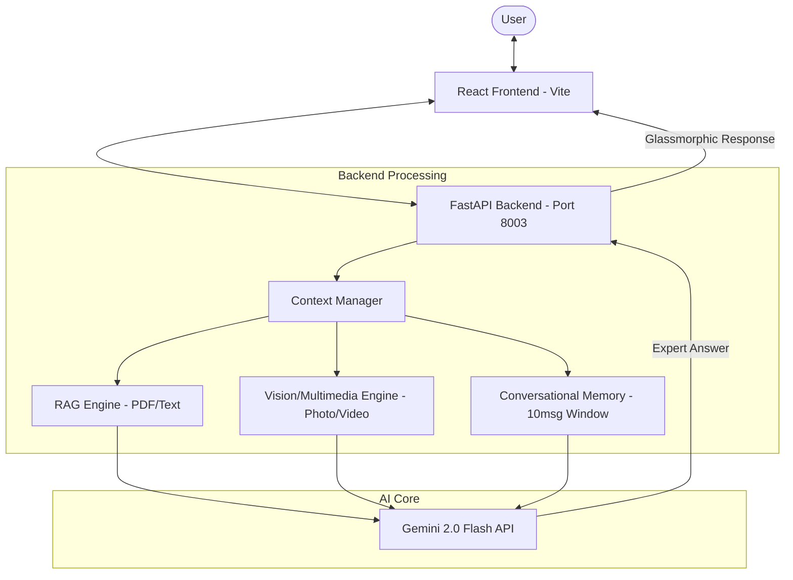

# 🧠 Knowledge Twin: The Ultimate Multimodal Assistant

**Knowledge Twin** is a high-performance, RAG-powered (Retrieval-Augmented Generation) artificial intelligence application. It is engineered to be a **World-Class Knowledge Expert**, capable of reading documents, seeing images, watching videos, and remembering entire conversations with state-of-the-art precision.

---

## 🏗️ System Architecture

The following diagram illustrates the high-level flow of the Knowledge Twin system, from user interaction to multimodal processing.



---

## 🚀 State-of-the-Art Features

### 1. **Multimodal Intelligence (The Eyes)** 📸🎥
The Twin isn't just a reader; it's a viewer. Using Gemini 2.0's native multimodal processing:
- **Vision Recognition**: Upload photographs or diagrams (JPG/PNG). The Twin analyzes visual textures, identifying objects, reading text within images (OCR), and explaining complex visual data.
- **Video Intuition**: Upload MP4 clips. The Twin can "watch" the video to summarize events, describe actions, or identify specific moments you ask about.
- **Multimedia UI**: Interactive player for videos and high-fidelity previews for photos within the chat stream.

### 2. **Professional RAG Engine (The Brain)** 📄🔍
Our Retrieval-Augmented Generation system is tuned for **"Precise Depth"**:
- **Expert Semantic Search**: Converts doc chunks into 768-dimensional vectors. When you ask a question, the Twin finds the *exact* context needed, even if the words don't match perfectly.
- **Dynamic Summarizer**: Instantly distills massive PDFs into 3-5 high-impact, emoji-rich bullet points.
- **Context Preservation**: The Twin builds its answers directly from your provided data, eliminating AI "hallucinations."

### 3. **Conversational Memory (The Recall)** 🧠💬
Most AIs forget as soon as you stop asking. The Knowledge Twin is different:
- **10-Message Window**: The Twin maintains a stateful history of the last 10 interactions.
- **Contextual Follow-ups**: Ask "Why is that?", "Give me another example," or "Go back to the first point"—the Twin handles these naturally.
- **Memory Persistence**: Knowledge stays active across multiple document uploads during a single session.

### 4. **Industrial-Grade Stability (The Shield)** 🛡️⚙️
Built for developers and professionals who need 100% uptime:
- **Rate-Limit Auto-Recovery**: Implements a proprietary 10-second "Deep Backoff" logic. If Google's API is busy, the Twin waits and retries automatically.
- **Ghost-Server Isolation**: Migrated to Port **8003** to prevent browser-stealing ghost processes.
- **Model Rotation**: A resilient fallback chain (2.0 Flash → 1.5 Pro → 1.5 Flash-8b) ensures you always get an answer.

### 5. **Security & Privacy First** 🔐📁
- **Root Protection**: A global `.gitignore` hides all `.env` secrets and `venv` environments.
- **No-Trace Backend**: Temporary uploads and debug logs are automatically cleared to keep your data footprint small.
- **Local Environment**: Everything runs locally on your machine—your API keys stay yours.

---

## 🎨 Design Aesthetics
The Knowledge Twin features a **Premium Glassmorphism Design System**:
- **Vibrant Gradients**: Deep blue to purple accents reflecting high-tech intelligence.
- **Micro-Animations**: Powered by **Framer Motion** for a smooth, app-like feel.
- **Typography**: Optimized Inter/Reddit-style fonts for maximum readability.
- **Responsive Layout**: Designed for high-end desktop monitoring and side-by-side research.

---

## 📂 Project Structure

```text
KnowledgeTwin/
├── backend/                # Python FastAPI Intelligence
│   ├── main.py             # API Routing & Payload Handling
│   ├── rag.py              # The Core RAG & Multimedia Logic
│   ├── requirements.txt    # Python Dependencies
│   └── .env                # API Key Storage (Private)
├── frontend/               # React (Vite) User Experience
│   ├── src/
│   │   ├── components/
│   │   │   └── Chat.jsx    # Glassmorphic Chat Interface
│   │   └── App.jsx         # Application Root
│   └── tailwind.config.js  # Premium Styling Config
├── .gitignore              # Global Security Mask
└── README.md               # Extensive Documentation
```

---

## 🛠️ Installation & Setup

### **Prerequisites**
- Python 3.10+
- Node.js 18+
- [Google Gemini API Key](https://aistudio.google.com/)

### **1. Backend Activation**
```powershell
# Navigate to backend
cd backend
# Install dependencies
pip install -r requirements.txt
# Create .env and add your key
echo "GEMINI_API_KEY=YOUR_KEY" > .env
# Launch with Port Isolation
python -m uvicorn main:app --host 0.0.0.0 --port 8003
```

### **2. Frontend Activation**
```bash
# Navigate to frontend
cd frontend
# Install packages
npm install
# Start dev server
npm run dev
```

### **3. Synchronization**
Ensure `Chat.jsx` points to:
`const HOST = "http://localhost:8003";`

---

## 🤝 Collaboration & Support
The Knowledge Twin is designed to be your most reliable pair-programmer and researcher. If you encounter a "Busy Modules" message, simply wait 10 seconds—our **Deep Recovery** system is busy working for you!

**Optimized for Excellence. Powered by Gemini 2.0. 🚀🤖🤝💖**
